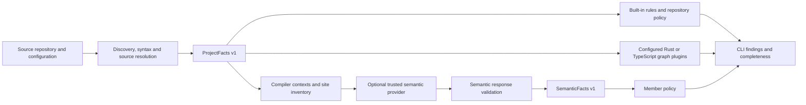
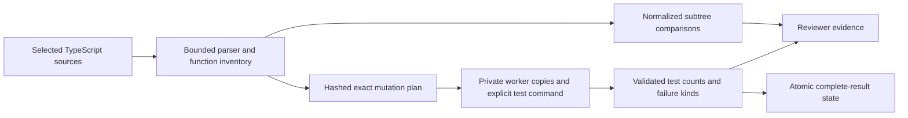

# Architecture and repository organization

Archguard has one Rust library and CLI. Source-graph analysis produces ProjectFacts v1; an explicitly configured compiler provider produces separate SemanticFacts v1. Policies consume facts and return findings. The CLI combines findings with analysis completeness and chooses the exit code.

## Product modules

| Module | Responsibility |
| --- | --- |
| `facts` | Versioned source-graph contract and diagnostics, independent of analysis and policy |
| `config` | Explicit configuration, validation, and selectors |
| `typescript`, `rust` | Syntax facts without repository policy |
| `project` | Source discovery, packages, and configured source resolution |
| `cache` | Optional validated persistence of complete source graphs |
| `rules`, `roles` | Built-in graph policies and configured file-role relationships |
| `plugin` | Graph-plugin protocol validation |
| `semantic/facts` | Separate compiler contract and completion/problem reporting |
| `semantic/config` | Trusted provider commands, contexts, and member policy configuration |
| `semantic/inventory` | Independent property-site inventory and hashed provider requests |
| `semantic/validation` | Response identity, inventory, location, and completion checks |
| `semantic/rules` | Member policies over validated compiler facts |
| `semantic/mod` | Public semantic API and provider coordination |
| `quality` | Explicit source selection, bounded syntax processing and versioned source locations |
| `dryer` | Function normalization, exact subtree comparison and validated extraction persistence |
| `mutator` | Verified source edits, explicit isolated test execution and validated run state |
| `subprocess` | Bounded Unix transport shared by graph plugins, semantic providers and mutation execution |
| `main` | Command parsing, rendering, and exit codes |

The public Rust module paths and JSON protocol versions remain unchanged. Semantic child modules are private and re-export the existing `semantic::*` API. The TypeScript SDK stays in `sdk/`. Graph and compiler contracts remain separate from the mutation request/result protocol and optional Vitest reporter.

## Ownership

| Directory | What belongs here |
| --- | --- |
| `src/` | Product library and CLI |
| `sdk/` | Public TypeScript extension contracts; Rust APIs come from the product crate |
| `providers/` | Independently installed optional compiler adapters |
| `tests/` | Generic product acceptance, protocol, and language parity checks |
| `examples/` | Reusable configs/plugins and adoption case studies such as T3 Code |
| `docs/` | User guides, extension guides, development guidance, and license inventories |
| `scripts/` | Routine validation and license maintenance |
| `research/` | Historical reproductions, experiments, tools, measurements, notes, and reports |

Keep one crate until an independently consumed component needs a separate package. A directory alone does not require a package. `Cargo.toml` explicitly names example targets and excludes research from the distributed crate through its file allowlist. Cargo's [manifest reference](https://doc.rust-lang.org/cargo/reference/manifest.html) describes those target and package controls.

`archguard.json` checks source import policies, SDK exports, and role classification. Rust syntax analysis resolves the first module component, so this check does not establish complete nested Rust dependency resolution. Compiler child-module import restrictions use written import names. Tests verify the actual public behavior and contracts.

## Dependencies

| Environment | Manifest | Used for |
| --- | --- | --- |
| Product | `Cargo.toml`, `Cargo.lock` | Rust analysis, resolution, policy, CLI, and transport |
| TypeScript SDK | No npm manifest | Node builtins only |
| Optional compiler provider | `providers/typescript7/package*.json` | TypeScript 7.0.2 and its native package |
| T3 semantic reproduction | `research/t3code/semantic/package*.json` | Effect 4.0.0-rc.112 declarations for historical fixtures |
| Comparative benchmarks | `research/benchmarks/toolchain/package*.json` | Oxlint and comparison compiler/parser tools |

There is no root npm workspace linking research tools into product installations. Existing dependency pins remain unchanged. Research source and recorded results are excluded from the crate package; small examples, SDK, provider adapter, and generic tests are retained.

## Review evidence

Duplicate and mutation commands consume their own explicit source selection. They do not expand architecture discovery or alter ProjectFacts v1 and SemanticFacts v1. Oxc parser/binding facts support normalization and runtime-edit inventories without supplying compiler types.

Mutation execution snapshots configured files and dependency copies. A fresh baseline is required every run. Reuse is opt-in and conservative over the full declared input digest. Process-group ownership and cleanup are checked before persisting reusable results. Incomplete input discovery, protocol failures and resource failures remain explicit. Limits protect trusted commands; they are not an arbitrary-code sandbox.

The CLI owns process signal handlers. Library callers pass a cancellation token. Node builtins implement the SDK protocol; an explicitly installed Vitest supplies actual test lifecycle events. No new product dependency, automatic runner discovery or CI gate is introduced. See the [user guide](../code-quality.md) and [protocol](../mutator-test-protocol.md).
